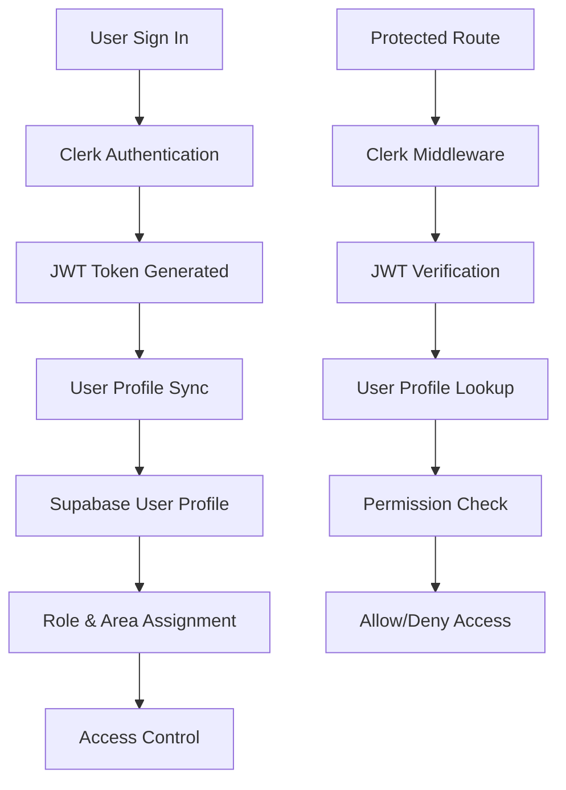
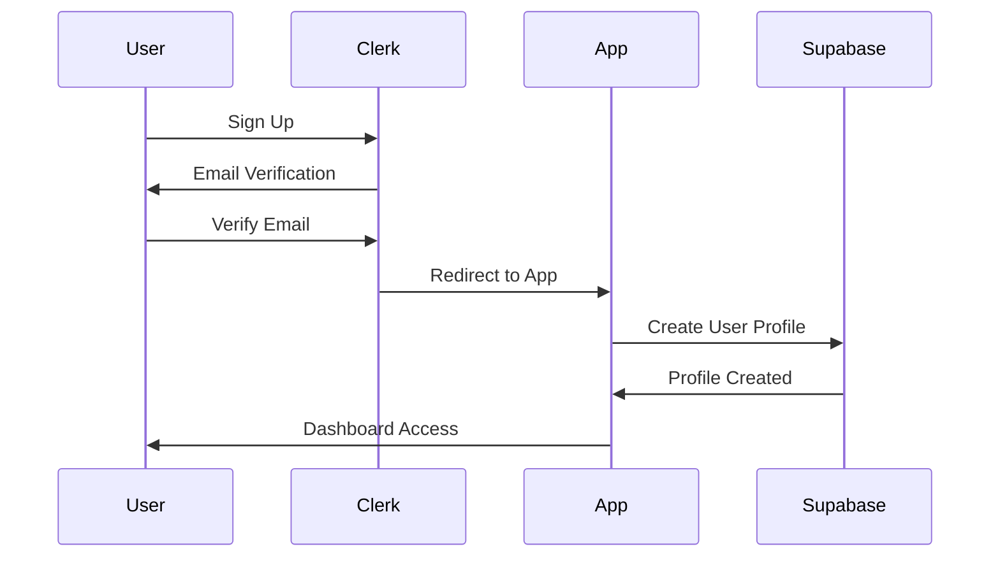
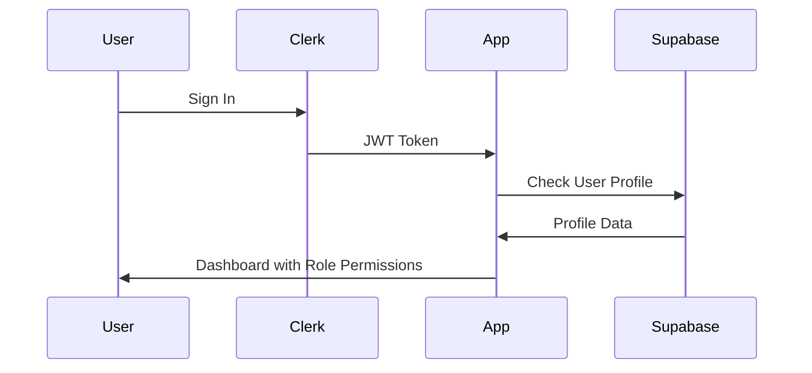
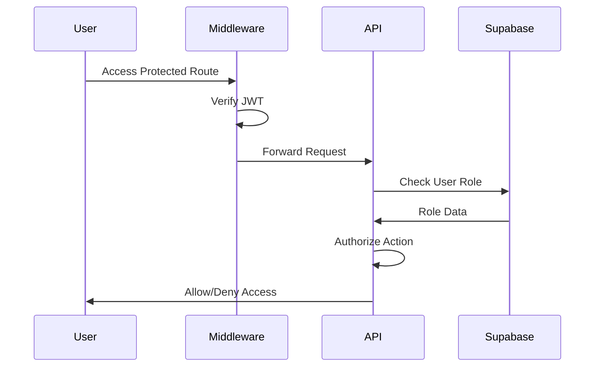

# Authentication System

## Overview

The application uses a dual authentication system combining **Clerk** for user authentication and **Supabase** for user profile management. This approach provides secure authentication with flexible role-based access control.

## Architecture



## Components

### 1. Clerk Authentication
**Purpose**: Handle user authentication, session management, and security
**Features**:
- Secure user sign-up/sign-in
- Session management
- JWT token generation
- OAuth providers (optional)
- Email verification
- Password reset

### 2. Supabase User Profiles
**Purpose**: Store application-specific user data and permissions
**Features**:
- User role management
- Area assignments
- Profile information
- Access control data

### 3. User Synchronization
**Purpose**: Keep Clerk and Supabase data in sync
**Process**:
1. User signs up/signs in via Clerk
2. Application checks if user exists in Supabase
3. If not exists, creates new profile
4. Syncs any profile updates

## User Roles

### Role Hierarchy
```
Superadmin (Full Access)
    ├── User Management
    ├── Area Management  
    ├── Global Inventory View
    └── System Configuration

Area Sales Manager (Area-Specific)
    ├── Assigned Area Access
    ├── Team Management
    ├── Inventory Overview
    └── Dashboard Access

Area Sales Supervisor (Read-Only)
    ├── Assigned Area View
    ├── Inventory View
    └── Basic Dashboard
```

### Role Permissions Matrix

| Feature | Superadmin | Area Sales Manager | Area Sales Supervisor |
|---------|------------|-------------------|----------------------|
| Dashboard | All Areas | Assigned Areas | Assigned Areas |
| Inventory View | All Areas | Assigned Areas | Assigned Areas |
| Inventory Edit | ✅ | ❌ | ❌ |
| User Management | ✅ | ❌ | ❌ |
| Area Management | ✅ | ❌ | ❌ |
| User Creation | ✅ | ❌ | ❌ |
| Role Assignment | ✅ | ❌ | ❌ |
| System Settings | ✅ | ❌ | ❌ |

## Implementation Details

### 1. Middleware Protection

**File**: `src/middleware.ts`

```typescript
import { clerkMiddleware, createRouteMatcher } from '@clerk/nextjs/server';

const isPublicRoute = createRouteMatcher([
  '/sign-in(.*)', 
  '/sign-up(.*)', 
  '/',
  '/api/webhooks/clerk'
]);

const isAdminRoute = createRouteMatcher(['/admin(.*)']);

export default clerkMiddleware(async (auth, request) => {
  // Public routes don't require authentication
  if (!isPublicRoute(request)) {
    await auth.protect();
  }
  
  // Admin routes require additional role check
  if (isAdminRoute(request)) {
    await auth.protect();
  }
});
```

**Features**:
- Protects all routes except public ones
- Special handling for admin routes
- Automatic redirect to sign-in for unauthenticated users

### 2. User Profile Synchronization

**File**: `src/components/UserSyncWrapper.tsx`

```typescript
'use client';

import { useUser } from '@clerk/nextjs';
import { useEffect, useState } from 'react';

export function UserSyncWrapper({ children }: { children: React.ReactNode }) {
  const { user, isLoaded } = useUser();
  const [synced, setSynced] = useState(false);

  useEffect(() => {
    const syncUser = async () => {
      if (!user || synced) return;

      try {
        const response = await fetch('/api/auth/sync-user', {
          method: 'POST',
          headers: { 'Content-Type': 'application/json' },
          body: JSON.stringify({
            clerkUserId: user.id,
            email: user.primaryEmailAddress?.emailAddress,
            fullName: user.fullName,
          }),
        });

        if (response.ok) {
          setSynced(true);
        }
      } catch (error) {
        console.error('User sync error:', error);
      }
    };

    if (isLoaded && user) {
      syncUser();
    }
  }, [user, isLoaded, synced]);

  // Show loading while syncing
  if (isLoaded && user && !synced) {
    return <div>Syncing user profile...</div>;
  }

  return <>{children}</>;
}
```

**Process**:
1. Monitors Clerk user state
2. Automatically syncs on first load
3. Creates Supabase profile if needed
4. Handles sync errors gracefully

### 3. API Route Protection

**Example**: `src/app/api/admin/users/route.ts`

```typescript
import { auth } from '@clerk/nextjs/server';
import { supabaseAdmin } from '@/lib/supabase';

async function checkSuperadminAccess(userId: string) {
  const { data: userProfile } = await supabaseAdmin
    .from('user_profiles')
    .select('role')
    .eq('clerk_user_id', userId)
    .single();

  return userProfile?.role === 'superadmin';
}

export async function GET() {
  try {
    // 1. Verify authentication
    const { userId } = await auth();
    if (!userId) {
      return NextResponse.json({ error: 'Unauthorized' }, { status: 401 });
    }

    // 2. Check role permissions
    const isSuperadmin = await checkSuperadminAccess(userId);
    if (!isSuperadmin) {
      return NextResponse.json({ error: 'Forbidden' }, { status: 403 });
    }

    // 3. Proceed with authorized action
    // ... API logic
  } catch (error) {
    return NextResponse.json({ error: 'Server error' }, { status: 500 });
  }
}
```

**Security Layers**:
1. **Authentication Check**: Verify JWT token
2. **Authorization Check**: Verify user role
3. **Data Access Control**: Check area permissions

## Database Schema

### User Profiles Table
```sql
CREATE TABLE user_profiles (
    id UUID PRIMARY KEY DEFAULT uuid_generate_v4(),
    clerk_user_id VARCHAR(255) NOT NULL UNIQUE,
    email VARCHAR(255),
    full_name VARCHAR(255),
    role VARCHAR(50) CHECK (role IN ('superadmin', 'area sales manager', 'area sales supervisor')),
    area_id INTEGER REFERENCES master_areas(id),
    is_active BOOLEAN DEFAULT TRUE,
    created_at TIMESTAMP WITH TIME ZONE DEFAULT CURRENT_TIMESTAMP,
    updated_at TIMESTAMP WITH TIME ZONE DEFAULT CURRENT_TIMESTAMP
);
```

### User Area Mappings (Multi-Area Support)
```sql
CREATE TABLE user_area_mappings (
    id SERIAL PRIMARY KEY,
    user_profile_id UUID NOT NULL REFERENCES user_profiles(id) ON DELETE CASCADE,
    area_id INTEGER NOT NULL REFERENCES master_areas(id) ON DELETE CASCADE,
    created_at TIMESTAMP WITH TIME ZONE DEFAULT CURRENT_TIMESTAMP,
    UNIQUE(user_profile_id, area_id)
);
```

## Row Level Security (RLS)

### User Profile Access
```sql
-- Users can view their own profile
CREATE POLICY "Users can view their own active profile" ON user_profiles
    FOR SELECT USING (
        is_active = TRUE AND clerk_user_id = auth.jwt() ->> 'sub'
    );

-- Superadmins can manage all profiles
CREATE POLICY "Superadmins can manage all user profiles" ON user_profiles
    FOR ALL USING (
        EXISTS (
            SELECT 1 FROM user_profiles 
            WHERE clerk_user_id = auth.jwt() ->> 'sub' 
            AND role = 'superadmin'
            AND is_active = TRUE
        )
    );
```

### Area-Based Access Control
```sql
-- Users can view areas they're assigned to
CREATE POLICY "Users can view their active assigned areas" ON master_areas
    FOR SELECT USING (
        is_active = TRUE AND (
            id IN (
                SELECT area_id FROM user_profiles 
                WHERE clerk_user_id = auth.jwt() ->> 'sub'
                AND is_active = TRUE
            ) OR 
            id IN (
                SELECT area_id FROM user_area_mappings uam
                JOIN user_profiles up ON uam.user_profile_id = up.id
                WHERE up.clerk_user_id = auth.jwt() ->> 'sub'
                AND up.is_active = TRUE
            )
        )
    );
```

## Authentication Flow

### 1. Initial Sign-Up


### 2. Subsequent Sign-Ins


### 3. Role-Based Route Access


## API Endpoints

### Authentication Endpoints
- `POST /api/auth/sync-user` - Sync Clerk user to database
- `GET /api/auth/profile` - Get current user profile
- `PUT /api/auth/profile` - Update user profile
- `GET /api/auth/check-user` - Check if user exists in database

### User Management (Superadmin Only)
- `GET /api/admin/users` - List all users
- `POST /api/admin/create-user` - Create new user
- `PUT /api/admin/users` - Update user role/area
- `PATCH /api/admin/users` - Activate/deactivate user

### Area Management (Superadmin Only)
- `GET /api/admin/areas` - List all areas
- `POST /api/admin/areas` - Create new area
- `PUT /api/admin/areas` - Update area details
- `PATCH /api/admin/areas` - Activate/deactivate area

## Security Considerations

### 1. Token Security
- JWT tokens are httpOnly cookies
- Automatic token refresh
- Secure token storage
- Token expiration handling

### 2. API Security
- All endpoints require authentication
- Role-based authorization
- Input validation
- SQL injection prevention

### 3. Data Protection
- Row Level Security enabled
- Area-based data isolation
- Audit logging
- Secure defaults

### 4. Client-Side Security
- No sensitive data in client state
- Protected route components
- Automatic logout on token expiry
- CSRF protection

## Testing Authentication

### Manual Testing
```bash
# Test public access
curl http://localhost:3000/api/test-db

# Test authenticated endpoint
curl -H "Authorization: Bearer <jwt-token>" \
     http://localhost:3000/api/auth/profile

# Test admin endpoint
curl -H "Authorization: Bearer <admin-jwt-token>" \
     http://localhost:3000/api/admin/users
```

### Browser Testing
1. Sign up with new account
2. Verify email
3. Check profile creation in Supabase
4. Test role-based access
5. Verify area permissions
6. Test sign-out/sign-in

## Troubleshooting

### Common Issues

#### User Not Syncing
- Check Clerk webhook configuration
- Verify API endpoint is accessible
- Check network requests in browser dev tools

#### Permission Denied
- Verify user role in database
- Check RLS policies
- Ensure user is active

#### JWT Token Issues
- Clear browser cookies
- Check token expiration
- Verify Clerk configuration

### Debug Steps
1. Check browser console for errors
2. Verify network requests
3. Check Supabase logs
4. Verify user profile data
5. Test with different roles