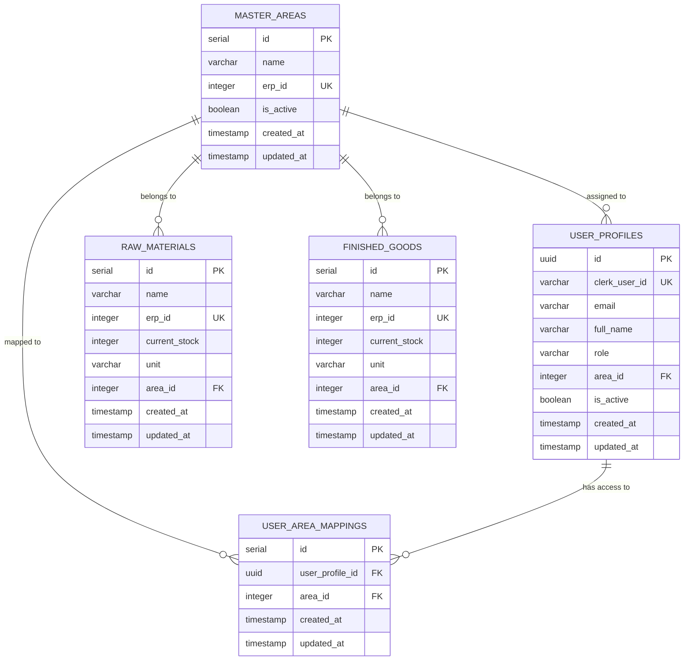

# Database Schema

## Overview

The application uses **PostgreSQL** via **Supabase** with a carefully designed schema that supports role-based access control, area-based data segregation, and multi-area user assignments. The database implements Row Level Security (RLS) for data protection.

## Entity Relationship Diagram



## Table Definitions

### 1. Master Areas (`master_areas`)

**Purpose**: Define organizational areas, regions, or departments

```sql
CREATE TABLE master_areas (
    id SERIAL PRIMARY KEY,
    name VARCHAR(255) NOT NULL,
    erp_id INTEGER NOT NULL UNIQUE,
    is_active BOOLEAN DEFAULT TRUE,
    created_at TIMESTAMP WITH TIME ZONE DEFAULT CURRENT_TIMESTAMP,
    updated_at TIMESTAMP WITH TIME ZONE DEFAULT CURRENT_TIMESTAMP
);
```

**Columns**:
- `id`: Auto-incrementing primary key
- `name`: Human-readable area name (e.g., "North Zone", "Warehouse A")
- `erp_id`: Unique identifier for ERP system integration
- `is_active`: Controls whether the area is currently operational
- `created_at`/`updated_at`: Audit timestamps

**Indexes**:
```sql
CREATE INDEX idx_master_areas_erp_id ON master_areas(erp_id);
CREATE INDEX idx_master_areas_is_active ON master_areas(is_active);
```

**Sample Data**:
```sql
INSERT INTO master_areas (name, erp_id) VALUES 
    ('North Zone', 1001),
    ('South Zone', 1002),
    ('East Zone', 1003),
    ('West Zone', 1004),
    ('Central Zone', 1005);
```

### 2. User Profiles (`user_profiles`)

**Purpose**: Store application-specific user data and permissions

```sql
CREATE TABLE user_profiles (
    id UUID PRIMARY KEY DEFAULT uuid_generate_v4(),
    clerk_user_id VARCHAR(255) NOT NULL UNIQUE,
    email VARCHAR(255),
    full_name VARCHAR(255),
    role VARCHAR(50) CHECK (role IN ('superadmin', 'area sales manager', 'area sales supervisor')) DEFAULT 'area sales supervisor',
    area_id INTEGER REFERENCES master_areas(id) ON DELETE SET NULL,
    is_active BOOLEAN DEFAULT TRUE,
    created_at TIMESTAMP WITH TIME ZONE DEFAULT CURRENT_TIMESTAMP,
    updated_at TIMESTAMP WITH TIME ZONE DEFAULT CURRENT_TIMESTAMP
);
```

**Columns**:
- `id`: UUID primary key for internal references
- `clerk_user_id`: Unique identifier from Clerk authentication
- `email`: User's email address (synced from Clerk)
- `full_name`: User's display name (synced from Clerk)
- `role`: User's permission level (constrained by CHECK)
- `area_id`: Primary area assignment (can be NULL)
- `is_active`: Controls user account status

**Roles**:
- `superadmin`: Full system access
- `area sales manager`: Area-specific management access
- `area sales supervisor`: Area-specific read-only access

**Indexes**:
```sql
CREATE INDEX idx_user_profiles_clerk_user_id ON user_profiles(clerk_user_id);
CREATE INDEX idx_user_profiles_area_id ON user_profiles(area_id);
CREATE INDEX idx_user_profiles_is_active ON user_profiles(is_active);
```

### 3. User Area Mappings (`user_area_mappings`)

**Purpose**: Enable multi-area assignments for users

```sql
CREATE TABLE user_area_mappings (
    id SERIAL PRIMARY KEY,
    user_profile_id UUID NOT NULL REFERENCES user_profiles(id) ON DELETE CASCADE,
    area_id INTEGER NOT NULL REFERENCES master_areas(id) ON DELETE CASCADE,
    created_at TIMESTAMP WITH TIME ZONE DEFAULT CURRENT_TIMESTAMP,
    updated_at TIMESTAMP WITH TIME ZONE DEFAULT CURRENT_TIMESTAMP,
    UNIQUE(user_profile_id, area_id)
);
```

**Features**:
- Many-to-many relationship between users and areas
- Unique constraint prevents duplicate assignments
- Cascade delete maintains referential integrity
- Supplements the primary area assignment in `user_profiles`

**Indexes**:
```sql
CREATE INDEX idx_user_area_mappings_user_profile_id ON user_area_mappings(user_profile_id);
CREATE INDEX idx_user_area_mappings_area_id ON user_area_mappings(area_id);
```

### 4. Raw Materials (`raw_materials`)

**Purpose**: Track raw material inventory by area

```sql
CREATE TABLE raw_materials (
    id SERIAL PRIMARY KEY,
    name VARCHAR(255) NOT NULL,
    erp_id INTEGER NOT NULL UNIQUE,
    current_stock INTEGER DEFAULT 0,
    unit VARCHAR(50) DEFAULT 'pieces',
    area_id INTEGER NOT NULL REFERENCES master_areas(id) ON DELETE CASCADE,
    created_at TIMESTAMP WITH TIME ZONE DEFAULT CURRENT_TIMESTAMP,
    updated_at TIMESTAMP WITH TIME ZONE DEFAULT CURRENT_TIMESTAMP
);
```

**Columns**:
- `name`: Material description
- `erp_id`: ERP system identifier
- `current_stock`: Current quantity in stock
- `unit`: Unit of measurement (kg, pieces, meters, etc.)
- `area_id`: Area where material is located

**Sample Data**:
```sql
INSERT INTO raw_materials (name, erp_id, current_stock, unit, area_id) VALUES 
    ('Steel Bars', 2001, 150, 'kg', 1),
    ('Aluminum Sheets', 2002, 200, 'pieces', 1),
    ('Copper Wire', 2003, 500, 'meters', 2);
```

### 5. Finished Goods (`finished_goods`)

**Purpose**: Track finished product inventory by area

```sql
CREATE TABLE finished_goods (
    id SERIAL PRIMARY KEY,
    name VARCHAR(255) NOT NULL,
    erp_id INTEGER NOT NULL UNIQUE,
    current_stock INTEGER DEFAULT 0,
    unit VARCHAR(50) DEFAULT 'pieces',
    area_id INTEGER NOT NULL REFERENCES master_areas(id) ON DELETE CASCADE,
    created_at TIMESTAMP WITH TIME ZONE DEFAULT CURRENT_TIMESTAMP,
    updated_at TIMESTAMP WITH TIME ZONE DEFAULT CURRENT_TIMESTAMP
);
```

**Structure**: Similar to raw materials but for finished products

**Sample Data**:
```sql
INSERT INTO finished_goods (name, erp_id, current_stock, unit, area_id) VALUES 
    ('Product A', 3001, 50, 'pieces', 1),
    ('Product B', 3002, 120, 'pieces', 1),
    ('Product C', 3003, 80, 'pieces', 2);
```

## Row Level Security (RLS)

### Overview
All tables use Row Level Security to enforce area-based access control at the database level.

### User Profile Policies
```sql
-- Users can view their own active profile
CREATE POLICY "Users can view their own active profile" ON user_profiles
    FOR SELECT USING (
        is_active = TRUE AND clerk_user_id = auth.jwt() ->> 'sub'
    );

-- Users can update their own profile
CREATE POLICY "Users can update their own active profile" ON user_profiles
    FOR UPDATE USING (
        is_active = TRUE AND clerk_user_id = auth.jwt() ->> 'sub'
    )
    WITH CHECK (clerk_user_id = auth.jwt() ->> 'sub');

-- Superadmins can manage all profiles
CREATE POLICY "Superadmins can manage all user profiles" ON user_profiles
    FOR ALL USING (
        EXISTS (
            SELECT 1 FROM user_profiles 
            WHERE clerk_user_id = auth.jwt() ->> 'sub' 
            AND role = 'superadmin'
            AND is_active = TRUE
        )
    );
```

### Area Access Policies
```sql
-- Users can view areas they're assigned to
CREATE POLICY "Users can view their active assigned areas" ON master_areas
    FOR SELECT USING (
        is_active = TRUE AND (
            id IN (
                SELECT area_id FROM user_profiles 
                WHERE clerk_user_id = auth.jwt() ->> 'sub'
                AND is_active = TRUE
            ) OR 
            id IN (
                SELECT area_id FROM user_area_mappings uam
                JOIN user_profiles up ON uam.user_profile_id = up.id
                WHERE up.clerk_user_id = auth.jwt() ->> 'sub'
                AND up.is_active = TRUE
            )
        )
    );

-- Superadmins can manage all areas
CREATE POLICY "Superadmins can manage all areas" ON master_areas
    FOR ALL USING (
        EXISTS (
            SELECT 1 FROM user_profiles 
            WHERE clerk_user_id = auth.jwt() ->> 'sub' 
            AND role = 'superadmin'
            AND is_active = TRUE
        )
    );
```

### Inventory Access Policies
```sql
-- Raw materials access based on user areas
CREATE POLICY "Users can view raw materials from their active areas" ON raw_materials
    FOR SELECT USING (
        area_id IN (
            SELECT id FROM master_areas ma 
            WHERE ma.is_active = TRUE AND (
                ma.id IN (
                    SELECT area_id FROM user_profiles 
                    WHERE clerk_user_id = auth.jwt() ->> 'sub' AND is_active = TRUE
                ) OR 
                ma.id IN (
                    SELECT area_id FROM user_area_mappings uam
                    JOIN user_profiles up ON uam.user_profile_id = up.id
                    WHERE up.clerk_user_id = auth.jwt() ->> 'sub' AND up.is_active = TRUE
                )
            )
        ) OR 
        EXISTS (
            SELECT 1 FROM user_profiles 
            WHERE clerk_user_id = auth.jwt() ->> 'sub' 
            AND role = 'superadmin' AND is_active = TRUE
        )
    );
```

## Database Functions

### Automatic Timestamp Updates
```sql
CREATE OR REPLACE FUNCTION update_updated_at_column()
RETURNS TRIGGER AS $$
BEGIN
    NEW.updated_at = CURRENT_TIMESTAMP;
    RETURN NEW;
END;
$$ language 'plpgsql';

-- Apply to all tables
CREATE TRIGGER update_master_areas_updated_at 
    BEFORE UPDATE ON master_areas 
    FOR EACH ROW EXECUTE FUNCTION update_updated_at_column();

CREATE TRIGGER update_user_profiles_updated_at 
    BEFORE UPDATE ON user_profiles 
    FOR EACH ROW EXECUTE FUNCTION update_updated_at_column();

CREATE TRIGGER update_user_area_mappings_updated_at 
    BEFORE UPDATE ON user_area_mappings 
    FOR EACH ROW EXECUTE FUNCTION update_updated_at_column();
```

## Data Access Patterns

### User Area Access
Users can access data from:
1. **Primary Area**: Set in `user_profiles.area_id`
2. **Additional Areas**: Listed in `user_area_mappings`
3. **Superadmin Exception**: Superadmins access all areas

### Multi-Area Query Example
```sql
-- Get all areas a user has access to
SELECT DISTINCT ma.* 
FROM master_areas ma
WHERE ma.is_active = TRUE 
AND (
    ma.id IN (
        SELECT area_id FROM user_profiles 
        WHERE clerk_user_id = 'user_123' AND is_active = TRUE
    ) 
    OR ma.id IN (
        SELECT area_id FROM user_area_mappings uam
        JOIN user_profiles up ON uam.user_profile_id = up.id
        WHERE up.clerk_user_id = 'user_123' AND up.is_active = TRUE
    )
);
```

## Migration Scripts

### Initial Schema Setup
**File**: `database_schema.sql`
- Creates all basic tables
- Sets up indexes and constraints
- Adds initial RLS policies
- Inserts sample data

### Feature Updates
**File**: `database_migration.sql`
- Adds `is_active` columns
- Creates `user_area_mappings` table
- Updates RLS policies for multi-area support
- Adds performance indexes

### Running Migrations
```sql
-- 1. Run initial schema
\i database_schema.sql

-- 2. Apply migrations
\i database_migration.sql

-- 3. Verify setup
SELECT table_name, row_security 
FROM information_schema.tables 
WHERE table_schema = 'public';
```

## Performance Considerations

### Indexing Strategy
```sql
-- Primary lookups
CREATE INDEX idx_user_profiles_clerk_user_id ON user_profiles(clerk_user_id);
CREATE INDEX idx_master_areas_erp_id ON master_areas(erp_id);

-- Area filtering
CREATE INDEX idx_raw_materials_area_id ON raw_materials(area_id);
CREATE INDEX idx_finished_goods_area_id ON finished_goods(area_id);

-- Status filtering
CREATE INDEX idx_master_areas_is_active ON master_areas(is_active);
CREATE INDEX idx_user_profiles_is_active ON user_profiles(is_active);

-- Multi-area mappings
CREATE INDEX idx_user_area_mappings_user_profile_id ON user_area_mappings(user_profile_id);
CREATE INDEX idx_user_area_mappings_area_id ON user_area_mappings(area_id);
```

### Query Optimization
- RLS policies use indexed columns
- Composite indexes for common query patterns
- Efficient JOIN strategies for multi-area queries

### Connection Management
```typescript
// Supabase client configuration
const supabaseAdmin = createClient(
  supabaseUrl,
  process.env.SUPABASE_SERVICE_ROLE_KEY!,
  {
    auth: {
      autoRefreshToken: false,
      persistSession: false
    }
  }
);
```

## Backup and Recovery

### Automated Backups
Supabase provides automatic daily backups:
- Point-in-time recovery
- Full database exports
- Schema-only exports

### Manual Backup Commands
```bash
# Full database backup
pg_dump -h your-host -U postgres -d your-db > backup.sql

# Schema only
pg_dump -h your-host -U postgres -d your-db --schema-only > schema.sql

# Data only
pg_dump -h your-host -U postgres -d your-db --data-only > data.sql
```

## Data Validation

### Constraints
```sql
-- Role validation
ALTER TABLE user_profiles 
ADD CONSTRAINT check_valid_role 
CHECK (role IN ('superadmin', 'area sales manager', 'area sales supervisor'));

-- Stock validation
ALTER TABLE raw_materials 
ADD CONSTRAINT check_positive_stock 
CHECK (current_stock >= 0);

-- Unique constraints
ALTER TABLE master_areas 
ADD CONSTRAINT unique_erp_id 
UNIQUE (erp_id);
```

### Application-Level Validation
- TypeScript interfaces ensure type safety
- Zod schemas for API validation
- Form validation on client side

## Troubleshooting

### Common Issues

#### RLS Policy Debugging
```sql
-- Check current policies
SELECT * FROM pg_policies WHERE tablename = 'user_profiles';

-- Test policy with specific user
SET role = authenticated;
SET request.jwt.claims.sub = 'user_123';
SELECT * FROM user_profiles;
```

#### Performance Issues
```sql
-- Check slow queries
SELECT query, mean_time, calls 
FROM pg_stat_statements 
ORDER BY mean_time DESC LIMIT 10;

-- Analyze query plans
EXPLAIN ANALYZE SELECT * FROM raw_materials WHERE area_id = 1;
```

#### Data Integrity Issues
```sql
-- Check foreign key violations
SELECT * FROM user_profiles WHERE area_id NOT IN (SELECT id FROM master_areas);

-- Verify user area mappings
SELECT up.email, ma.name 
FROM user_profiles up
LEFT JOIN user_area_mappings uam ON up.id = uam.user_profile_id
LEFT JOIN master_areas ma ON uam.area_id = ma.id;
```

## Future Considerations

### Scalability Enhancements
- Partitioning large tables by area
- Read replicas for reporting
- Connection pooling optimization

### Feature Extensions
- Audit logging table
- Historical data tracking
- Advanced permission granularity
- Multi-tenant architecture