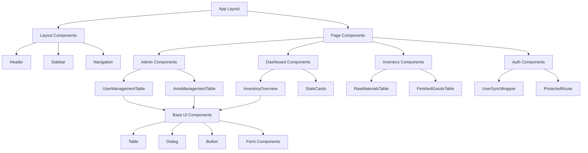

# UI Components Guide

## Overview

The application uses a modern component architecture built with **React**, **TypeScript**, and **shadcn/ui**. The components are designed to be responsive, accessible, and maintainable, following a consistent design system.

## Component Architecture



## Component Categories

### 1. Layout Components (`src/components/layout/`)

#### Header Component
**File**: `src/components/layout/Header.tsx`

```typescript
interface HeaderProps {
  title?: string;
  user?: UserProfile;
  showUserMenu?: boolean;
}

export function Header({ title, user, showUserMenu = true }: HeaderProps) {
  // Header implementation with user menu, notifications, and navigation
}
```

**Features**:
- User profile dropdown
- Navigation breadcrumbs
- Responsive design
- Role-based menu items

#### Sidebar Component
**File**: `src/components/layout/Sidebar.tsx`

```typescript
interface SidebarProps {
  isCollapsed?: boolean;
  onToggle?: () => void;
  userRole?: string;
}

export function Sidebar({ isCollapsed, onToggle, userRole }: SidebarProps) {
  // Sidebar with role-based navigation
}
```

**Features**:
- Collapsible design
- Role-based navigation filtering
- Active state indication
- Mobile-responsive drawer

#### Navigation Component
**File**: `src/components/layout/Navigation.tsx`

```typescript
interface NavigationItem {
  label: string;
  href: string;
  icon: React.ComponentType;
  roles: string[];
  children?: NavigationItem[];
}

const navigationItems: NavigationItem[] = [
  {
    label: "Dashboard",
    href: "/dashboard",
    icon: Home,
    roles: ["superadmin", "area sales manager", "area sales supervisor"]
  },
  {
    label: "Admin",
    href: "/admin",
    icon: Settings,
    roles: ["superadmin"],
    children: [
      {
        label: "User Management",
        href: "/admin/users",
        icon: Users,
        roles: ["superadmin"]
      }
    ]
  }
];
```

**Features**:
- Hierarchical navigation structure
- Role-based item filtering
- Active route highlighting
- Icon integration

### 2. Admin Components (`src/components/admin/`)

#### UserManagementTable Component
**File**: `src/components/admin/UserManagementTable.tsx`

```typescript
interface UserProfile {
  id: string;
  clerk_user_id: string;
  email: string;
  full_name?: string;
  role: string;
  area_id?: number;
  is_active: boolean;
  master_areas?: {
    id: number;
    name: string;
    erp_id: number;
  };
}

export function UserManagementTable() {
  // User management functionality
}
```

**Features**:
- **Pagination**: 5/10/15 records per page
- **CRUD Operations**: Create, edit, activate/deactivate users
- **Area Management**: Assign users to multiple areas
- **Role Management**: Change user roles
- **Responsive Design**: Mobile-friendly dialogs
- **Real-time Updates**: Refresh mechanism

**Key Interactions**:
```typescript
// User Creation
const handleAddUser = async () => {
  const response = await fetch('/api/admin/create-user', {
    method: 'POST',
    body: JSON.stringify({
      username: formData.username,
      email: formData.email,
      fullName: formData.fullName,
      areaId: formData.areaId
    })
  });
};

// Multi-Area Assignment
const handleAddAreaMapping = async (areaId: number) => {
  const response = await fetch('/api/admin/user-area-mappings', {
    method: 'POST',
    body: JSON.stringify({
      userProfileId: selectedUserId,
      areaId: areaId
    })
  });
};
```

#### AreaManagementTable Component
**File**: `src/components/admin/AreaManagementTable.tsx`

```typescript
interface Area {
  id: number;
  name: string;
  erp_id: number;
  is_active: boolean;
  created_at: string;
  updated_at: string;
}

export function AreaManagementTable() {
  // Area management functionality
}
```

**Features**:
- **Area CRUD**: Create, edit, delete areas
- **Status Management**: Activate/deactivate areas
- **Cascade Operations**: Handle user deactivation when areas are removed
- **Pagination**: Consistent with user management
- **ERP Integration**: Manage ERP IDs

### 3. Dashboard Components (`src/components/dashboard/`)

#### InventoryOverview Component
**File**: `src/components/dashboard/InventoryOverview.tsx`

```typescript
interface InventoryData {
  totalRawMaterials: number;
  totalFinishedGoods: number;
  lowStockItems: number;
  areas: Array<{
    id: number;
    name: string;
    rawMaterialsCount: number;
    finishedGoodsCount: number;
  }>;
}

export function InventoryOverview() {
  // Dashboard overview implementation
}
```

**Features**:
- **Statistics Cards**: Key inventory metrics
- **Area Breakdown**: Per-area inventory summary
- **Visual Indicators**: Stock level warnings
- **Real-time Data**: Auto-refresh capabilities

#### StatsCard Component
**File**: `src/components/dashboard/StatsCard.tsx`

```typescript
interface StatsCardProps {
  title: string;
  value: number | string;
  change?: number;
  trend?: 'up' | 'down' | 'neutral';
  icon?: React.ComponentType;
  color?: 'blue' | 'green' | 'red' | 'yellow';
}

export function StatsCard({
  title,
  value,
  change,
  trend,
  icon: Icon,
  color = 'blue'
}: StatsCardProps) {
  // Stats card implementation
}
```

**Features**:
- **Visual Design**: Color-coded indicators
- **Trend Display**: Up/down/neutral trends
- **Icon Integration**: Contextual icons
- **Responsive Layout**: Adapts to screen size

### 4. Inventory Components (`src/components/inventory/`)

#### RawMaterialsTable Component
**File**: `src/components/inventory/RawMaterialsTable.tsx`

```typescript
interface RawMaterial {
  id: number;
  name: string;
  erp_id: number;
  current_stock: number;
  unit: string;
  area_id: number;
  master_areas: {
    id: number;
    name: string;
    erp_id: number;
  };
}

export function RawMaterialsTable() {
  // Raw materials display and management
}
```

**Features**:
- **Data Display**: Tabular raw materials data
- **Search/Filter**: Find specific materials
- **Area Filtering**: Show only user's areas
- **Stock Levels**: Visual stock indicators
- **Export Functionality**: Data export options

#### FinishedGoodsTable Component
**File**: `src/components/inventory/FinishedGoodsTable.tsx`

Similar structure to RawMaterialsTable but for finished goods inventory.

### 5. Authentication Components (`src/components/auth/`)

#### UserSyncWrapper Component
**File**: `src/components/UserSyncWrapper.tsx`

```typescript
export function UserSyncWrapper({ children }: { children: React.ReactNode }) {
  const { user, isLoaded } = useUser();
  const [synced, setSynced] = useState(false);

  // Handles automatic user synchronization between Clerk and Supabase
}
```

**Features**:
- **Automatic Sync**: Syncs user data on app load
- **Loading States**: Shows sync progress
- **Error Handling**: Graceful sync failure handling
- **Profile Creation**: Creates profile if needed

#### ProtectedRoute Component
**File**: `src/components/auth/ProtectedRoute.tsx`

```typescript
interface ProtectedRouteProps {
  children: React.ReactNode;
  allowedRoles?: string[];
  requiredArea?: number;
}

export function ProtectedRoute({
  children,
  allowedRoles,
  requiredArea
}: ProtectedRouteProps) {
  // Route protection based on roles and areas
}
```

**Features**:
- **Role-Based Access**: Check user roles
- **Area-Based Access**: Check area permissions
- **Automatic Redirects**: Redirect unauthorized users
- **Loading States**: Show loading while checking permissions

## Base UI Components (`src/components/ui/`)

Built with **shadcn/ui**, these components provide the foundation for the application's design system.

### Core Components

#### Button Component
```typescript
interface ButtonProps extends React.ButtonHTMLAttributes<HTMLButtonElement> {
  variant?: 'default' | 'destructive' | 'outline' | 'secondary' | 'ghost' | 'link';
  size?: 'default' | 'sm' | 'lg' | 'icon';
  asChild?: boolean;
}

export const Button = React.forwardRef<HTMLButtonElement, ButtonProps>(
  ({ className, variant = 'default', size = 'default', asChild = false, ...props }, ref) => {
    // Button implementation
  }
);
```

#### Table Components
```typescript
// Table structure components
export const Table = React.forwardRef<HTMLTableElement, React.HTMLAttributes<HTMLTableElement>>();
export const TableHeader = React.forwardRef<HTMLTableSectionElement, React.HTMLAttributes<HTMLTableSectionElement>>();
export const TableBody = React.forwardRef<HTMLTableSectionElement, React.HTMLAttributes<HTMLTableSectionElement>>();
export const TableRow = React.forwardRef<HTMLTableRowElement, React.HTMLAttributes<HTMLTableRowElement>>();
export const TableHead = React.forwardRef<HTMLTableCellElement, React.ThHTMLAttributes<HTMLTableCellElement>>();
export const TableCell = React.forwardRef<HTMLTableCellElement, React.TdHTMLAttributes<HTMLTableCellElement>>();
```

#### Dialog Components
```typescript
interface DialogProps {
  open?: boolean;
  onOpenChange?: (open: boolean) => void;
  children: React.ReactNode;
}

// Dialog component structure
export const Dialog = ({ open, onOpenChange, children }: DialogProps) => {};
export const DialogContent = React.forwardRef<HTMLDivElement, DialogContentProps>();
export const DialogHeader = ({ children }: { children: React.ReactNode }) => {};
export const DialogTitle = React.forwardRef<HTMLHeadingElement, DialogTitleProps>();
```

#### Form Components
```typescript
// Input component
export const Input = React.forwardRef<HTMLInputElement, InputProps>();

// Label component
export const Label = React.forwardRef<HTMLLabelElement, LabelProps>();

// Select components
export const Select = ({ onValueChange, defaultValue, children }: SelectProps) => {};
export const SelectContent = React.forwardRef<HTMLDivElement, SelectContentProps>();
export const SelectItem = React.forwardRef<HTMLDivElement, SelectItemProps>();
export const SelectTrigger = React.forwardRef<HTMLButtonElement, SelectTriggerProps>();
export const SelectValue = ({ placeholder }: SelectValueProps) => {};
```

### Custom Components

#### Pagination Component
**File**: `src/components/ui/pagination.tsx`

```typescript
interface PaginationProps {
  currentPage: number;
  totalPages: number;
  pageSize: number;
  totalItems: number;
  onPageChange: (page: number) => void;
  onPageSizeChange: (pageSize: number) => void;
  pageSizeOptions?: number[];
}

export function Pagination({
  currentPage,
  totalPages,
  pageSize,
  totalItems,
  onPageChange,
  onPageSizeChange,
  pageSizeOptions = [5, 10, 15]
}: PaginationProps) {
  // Pagination implementation with responsive design
}
```

**Features**:
- **Page Navigation**: Previous, next, and direct page navigation
- **Page Size Selection**: Dropdown to change items per page
- **Responsive Design**: Adapts to mobile screens
- **Accessibility**: Proper ARIA labels and keyboard navigation

## Responsive Design Patterns

### Mobile-First Approach
```css
/* Default styles for mobile */
.component {
  @apply flex flex-col gap-2 p-4;
}

/* Tablet and up */
@media (min-width: 640px) {
  .component {
    @apply flex-row gap-4 p-6;
  }
}

/* Desktop and up */
@media (min-width: 1024px) {
  .component {
    @apply gap-6 p-8;
  }
}
```

### Responsive Dialog Pattern
```typescript
// Responsive dialog implementation
<DialogContent className="w-[95vw] max-w-4xl max-h-[90vh] overflow-hidden flex flex-col">
  <DialogHeader className="flex-shrink-0">
    <DialogTitle>Manage Area Assignments</DialogTitle>
  </DialogHeader>
  
  <div className="flex-1 overflow-y-auto px-1">
    {/* Scrollable content */}
  </div>
  
  <div className="flex-shrink-0 pt-4 border-t mt-4">
    {/* Fixed footer */}
  </div>
</DialogContent>
```

### Responsive Table Pattern
```typescript
// Mobile-friendly table with horizontal scroll
<div className="overflow-x-auto">
  <Table>
    <TableHeader>
      <TableRow>
        <TableHead className="min-w-[200px]">Name</TableHead>
        <TableHead className="min-w-[150px]">Role</TableHead>
        <TableHead className="min-w-[100px]">Status</TableHead>
        <TableHead className="text-right min-w-[100px]">Actions</TableHead>
      </TableRow>
    </TableHeader>
    <TableBody>
      {/* Table content */}
    </TableBody>
  </Table>
</div>
```

## State Management Patterns

### Component State
```typescript
// Local state management with useState
export function UserManagementTable() {
  const [users, setUsers] = useState<UserProfile[]>([]);
  const [loading, setLoading] = useState(true);
  const [error, setError] = useState<string | null>(null);
  const [currentPage, setCurrentPage] = useState(1);
  const [pageSize, setPageSize] = useState(5);
  
  // Component logic
}
```

### Computed State with useMemo
```typescript
// Optimized pagination calculation
const paginatedUsers = useMemo(() => {
  const startIndex = (currentPage - 1) * pageSize;
  const endIndex = startIndex + pageSize;
  return users.slice(startIndex, endIndex);
}, [users, currentPage, pageSize]);

const totalPages = Math.ceil(users.length / pageSize);
```

### Form State Management
```typescript
// Form state for complex forms
const [formData, setFormData] = useState({
  username: '',
  email: '',
  fullName: '',
  areaId: null as number | null
});

// Form submission handling
const handleSubmit = async (e: React.FormEvent) => {
  e.preventDefault();
  
  try {
    const response = await fetch('/api/admin/create-user', {
      method: 'POST',
      headers: { 'Content-Type': 'application/json' },
      body: JSON.stringify(formData)
    });
    
    if (response.ok) {
      // Handle success
      setFormData({ username: '', email: '', fullName: '', areaId: null });
      toast({ title: "Success", description: "User created successfully" });
    }
  } catch (error) {
    // Handle error
    toast({ title: "Error", description: "Failed to create user", variant: "destructive" });
  }
};
```

## Accessibility Features

### Keyboard Navigation
- **Tab Order**: Logical tab sequence through interactive elements
- **Enter/Space**: Activate buttons and clickable elements
- **Escape**: Close dialogs and dropdowns
- **Arrow Keys**: Navigate through menu items and table rows

### ARIA Labels
```typescript
// Proper ARIA labeling
<Button
  aria-label="Add new user"
  aria-describedby="add-user-description"
  onClick={handleAddUser}
>
  <UserPlus className="h-4 w-4 mr-2" />
  Add User
</Button>

<div id="add-user-description" className="sr-only">
  Opens a dialog to create a new user account
</div>
```

### Screen Reader Support
```typescript
// Screen reader announcements
<div role="status" aria-live="polite" className="sr-only">
  {loading ? "Loading users..." : `Showing ${users.length} users`}
</div>

// Table headers for screen readers
<TableHead scope="col">User Name</TableHead>
<TableHead scope="col">Role</TableHead>
<TableHead scope="col">Status</TableHead>
```

### Focus Management
```typescript
// Focus management in dialogs
const dialogRef = useRef<HTMLDivElement>(null);
const firstInputRef = useRef<HTMLInputElement>(null);

useEffect(() => {
  if (open && firstInputRef.current) {
    firstInputRef.current.focus();
  }
}, [open]);

// Trap focus within dialog
const handleKeyDown = (e: React.KeyboardEvent) => {
  if (e.key === 'Escape') {
    onClose();
  }
  
  if (e.key === 'Tab') {
    // Focus trap logic
  }
};
```

## Performance Optimization

### Lazy Loading
```typescript
// Lazy load heavy components
const UserManagementTable = lazy(() => import('./UserManagementTable'));
const AreaManagementTable = lazy(() => import('./AreaManagementTable'));

// Use with Suspense
<Suspense fallback={<TableSkeleton />}>
  <UserManagementTable />
</Suspense>
```

### Memoization
```typescript
// Memoize expensive calculations
const filteredUsers = useMemo(() => {
  return users.filter(user => 
    user.full_name?.toLowerCase().includes(searchTerm.toLowerCase()) ||
    user.email.toLowerCase().includes(searchTerm.toLowerCase())
  );
}, [users, searchTerm]);

// Memoize callback functions
const handleUserUpdate = useCallback((userId: string, updates: Partial<UserProfile>) => {
  setUsers(prev => prev.map(user => 
    user.id === userId ? { ...user, ...updates } : user
  ));
}, []);
```

### Virtual Scrolling (Future Enhancement)
```typescript
// For large datasets
import { FixedSizeList as List } from 'react-window';

const Row = ({ index, style }: { index: number; style: React.CSSProperties }) => (
  <div style={style}>
    <UserRow user={users[index]} />
  </div>
);

<List
  height={600}
  itemCount={users.length}
  itemSize={60}
>
  {Row}
</List>
```

## Testing Patterns

### Component Testing
```typescript
// Example test for UserManagementTable
import { render, screen, fireEvent, waitFor } from '@testing-library/react';
import { UserManagementTable } from './UserManagementTable';

describe('UserManagementTable', () => {
  it('renders user list correctly', async () => {
    render(<UserManagementTable />);
    
    await waitFor(() => {
      expect(screen.getByText('User Management')).toBeInTheDocument();
    });
    
    // Test pagination
    fireEvent.click(screen.getByLabelText('Next page'));
    
    // Test user creation
    fireEvent.click(screen.getByText('Add User'));
    expect(screen.getByRole('dialog')).toBeInTheDocument();
  });
});
```

### Integration Testing
```typescript
// Test component with API integration
import { render, screen, waitFor } from '@testing-library/react';
import { rest } from 'msw';
import { setupServer } from 'msw/node';

const server = setupServer(
  rest.get('/api/admin/users', (req, res, ctx) => {
    return res(ctx.json({
      data: [
        { id: '1', full_name: 'John Doe', email: 'john@example.com' }
      ]
    }));
  })
);

beforeAll(() => server.listen());
afterEach(() => server.resetHandlers());
afterAll(() => server.close());
```

## Design System Guidelines

### Color Palette
```css
:root {
  /* Primary colors */
  --primary: 210 40% 98%;
  --primary-foreground: 222.2 84% 4.9%;
  
  /* Secondary colors */
  --secondary: 210 40% 96%;
  --secondary-foreground: 222.2 84% 4.9%;
  
  /* Accent colors */
  --accent: 210 40% 96%;
  --accent-foreground: 222.2 84% 4.9%;
  
  /* Status colors */
  --destructive: 0 84.2% 60.2%;
  --warning: 38 92% 50%;
  --success: 142 76% 36%;
  --info: 221 83% 53%;
}
```

### Typography Scale
```css
/* Typography utilities */
.text-xs { font-size: 0.75rem; line-height: 1rem; }
.text-sm { font-size: 0.875rem; line-height: 1.25rem; }
.text-base { font-size: 1rem; line-height: 1.5rem; }
.text-lg { font-size: 1.125rem; line-height: 1.75rem; }
.text-xl { font-size: 1.25rem; line-height: 1.75rem; }
.text-2xl { font-size: 1.5rem; line-height: 2rem; }
```

### Spacing System
```css
/* Spacing utilities (Tailwind CSS) */
.space-1 { gap: 0.25rem; }
.space-2 { gap: 0.5rem; }
.space-4 { gap: 1rem; }
.space-6 { gap: 1.5rem; }
.space-8 { gap: 2rem; }
```

### Component Variants
```typescript
// Button variants following design system
const buttonVariants = {
  variant: {
    default: "bg-primary text-primary-foreground hover:bg-primary/90",
    destructive: "bg-destructive text-destructive-foreground hover:bg-destructive/90",
    outline: "border border-input bg-background hover:bg-accent hover:text-accent-foreground",
    secondary: "bg-secondary text-secondary-foreground hover:bg-secondary/80",
    ghost: "hover:bg-accent hover:text-accent-foreground",
    link: "text-primary underline-offset-4 hover:underline"
  },
  size: {
    default: "h-10 px-4 py-2",
    sm: "h-9 rounded-md px-3",
    lg: "h-11 rounded-md px-8",
    icon: "h-10 w-10"
  }
};
```