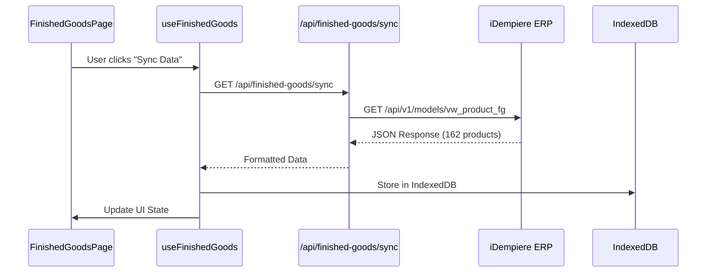

# Finished Goods iDempiere Integration

## Overview

The Finished Goods system provides seamless integration with external iDempiere ERP systems, enabling real-time access to product data with client-side persistent storage. The system follows a user-centric data lifecycle approach where data is populated only on user login and completely cleared on logout.

## Key Features

### 🔗 iDempiere ERP Integration
- **Direct API Connection**: Connects to `${NEXT_IDEMPIERE_URL}/api/v1/models/vw_product_fg`
- **Bearer Token Authentication**: Secure authentication using `IDEMPIERE_TOKEN`
- **Real-time Data Sync**: On-demand data synchronization from ERP system
- **Comprehensive Error Handling**: Network timeouts, API errors, and connectivity issues

### 💾 IndexedDB Persistent Storage
- **Browser-based Storage**: Uses IndexedDB for client-side data persistence
- **MDN Compliant Implementation**: Follows Mozilla Developer Network best practices
- **Structured Data Organization**: Separate object stores for products, categories, and metadata
- **Optimized Indexing**: Fast search and retrieval with multiple indexes

### 🔄 Data Lifecycle Management
- **Login-triggered Population**: Data sync occurs ONLY when user signs in
- **Logout-triggered Cleanup**: Complete data destruction when user signs out
- **Session-based Persistence**: Data survives browser sessions while logged in
- **Automatic Cleanup**: Handles page unload and tab visibility changes

### 🔍 Advanced Search & Filtering
- **Product Search**: Search by product name and product code
- **Category Filtering**: Filter products by extracted categories
- **Dynamic Categories**: Categories automatically extracted from API data
- **Real-time Results**: Instant search results with IndexedDB queries

## Technical Architecture

### Components Overview

```
┌─────────────────┐    ┌──────────────────┐    ┌─────────────────┐
│  FinishedGoods  │───▶│   useFinished    │───▶│   IndexedDB     │
│     Page        │    │     Goods        │    │   Storage       │
│   (UI Layer)    │    │   (Hook Layer)   │    │ (Data Layer)    │
└─────────────────┘    └──────────────────┘    └─────────────────┘
         │                       │                       │
         │                       ▼                       │
         │              ┌──────────────────┐             │
         │              │  iDempiere API   │             │
         │              │   Integration    │             │
         │              │ (Server Layer)   │             │
         │              └──────────────────┘             │
         │                       │                       │
         ▼                       ▼                       ▼
┌─────────────────┐    ┌──────────────────┐    ┌─────────────────┐
│ FinishedGoods   │    │   API Routes     │    │   Data Lifecycle│
│ DataManager     │    │ /api/finished-   │    │    Manager      │
│ (Lifecycle)     │    │  goods/sync      │    │ (Auth Events)   │
└─────────────────┘    └──────────────────┘    └─────────────────┘
```

### File Structure

```
src/
├── app/api/finished-goods/sync/route.ts      # Server API endpoints
├── components/
│   ├── FinishedGoodsDataManager.tsx          # Lifecycle management
│   └── inventory/FinishedGoodsPage.tsx       # Main UI component
├── hooks/useFinishedGoods.ts                 # React state management
└── lib/
    ├── indexeddb.ts                          # IndexedDB implementation
    └── idempiere-api.ts                      # API integration utilities
```

## Implementation Details

### 1. IndexedDB Schema

```typescript
interface FinishedGood {
  id: number;
  product_code: string;
  product_name: string;
  catname: string;
  catname_value: number;
  parent1: string;
  parent2: string;
  Weight: number;
  smalluom: string;
  biguom: string;
  // ... additional iDempiere fields
}

interface FinishedGoodCategory {
  id: number;
  name: string;
  parent1: string;
  parent2: string;
  product_count: number;
}
```

**Object Stores:**
- `finished_goods`: Primary product data with indexes on `product_code`, `catname_value`, `catname`
- `categories`: Extracted categories with product counts
- `metadata`: Sync timestamps and status information

### 2. Data Lifecycle Events

```typescript
// On User Sign In
useEffect(() => {
  if (isSignedIn && user) {
    await finishedGoodsDB.init();
    // Ready for manual sync trigger
  }
}, [isSignedIn, user]);

// On User Sign Out
useEffect(() => {
  if (!isSignedIn) {
    await finishedGoodsDB.clearAllData();
    // All data permanently removed
  }
}, [isSignedIn]);
```

### 3. API Integration Flow



## Configuration

### Environment Variables

```bash
# Required for iDempiere integration
NEXT_IDEMPIERE_URL=https://your-idempiere-server.com
IDEMPIERE_TOKEN=eyJraWQiOiJpZGVtcGllcmUi...

# Note: IDEMPIERE_TOKEN must remain private (server-side only)
# Do NOT use NEXT_IDEMPIERE_TOKEN (would expose token to client)
```

### Security Considerations

1. **Token Security**: `IDEMPIERE_TOKEN` is kept server-side only
2. **Authentication Gates**: All API calls require valid Clerk authentication
3. **Data Isolation**: Each user's IndexedDB data is isolated
4. **Automatic Cleanup**: Data cleared on logout prevents data leakage

## Usage Guide

### For Developers

#### 1. Basic Integration
```typescript
import { useFinishedGoods } from '@/hooks/useFinishedGoods';

function MyComponent() {
  const {
    finishedGoods,
    categories,
    loading,
    error,
    syncData,
    searchProducts
  } = useFinishedGoods();

  // Trigger sync
  const handleSync = async () => {
    await syncData();
  };

  // Search products
  const handleSearch = async (term: string) => {
    const results = await searchProducts(term);
    return results;
  };
}
```

#### 2. Direct IndexedDB Access
```typescript
import { finishedGoodsDB } from '@/lib/indexeddb';

// Get all products
const products = await finishedGoodsDB.getFinishedGoods();

// Search products
const searchResults = await finishedGoodsDB.searchFinishedGoods('BERAS');

// Get products by category
const categoryProducts = await finishedGoodsDB.getFinishedGoodsByCategory(1000067);
```

### For End Users

#### 1. Initial Setup
1. Sign in to the application
2. Navigate to "Finished Goods" in the sidebar
3. Click "Sync Data" to populate data from iDempiere
4. Data is now available for offline use

#### 2. Daily Usage
- **Search**: Use the search bar to find products by name or code
- **Filter**: Select categories from the dropdown to filter products
- **Refresh**: Click "Refresh" to reload data from IndexedDB
- **Re-sync**: Click "Sync Data" to fetch latest data from iDempiere

#### 3. Data Management
- Data persists across browser sessions while logged in
- Data is automatically cleared when you sign out
- No manual cleanup required

## Troubleshooting

### Common Issues

#### 1. Sync Failures
```
Error: Failed to fetch finished goods from iDempiere
```
**Solutions:**
- Check `NEXT_IDEMPIERE_URL` configuration
- Verify `IDEMPIERE_TOKEN` is valid and not expired
- Ensure iDempiere server is accessible
- Check network connectivity

#### 2. IndexedDB Errors
```
Error: Failed to store data in IndexedDB
```
**Solutions:**
- Check browser compatibility (Chrome, Firefox, Safari, Edge)
- Ensure sufficient browser storage space
- Clear browser data if corrupted
- Check for browser extensions blocking IndexedDB

#### 3. Authentication Issues
```
Error: Unauthorized. Please sign in to access finished goods.
```
**Solutions:**
- Ensure user is signed in with Clerk
- Check Clerk session validity
- Refresh browser if session expired

### Debugging Tips

#### 1. Check IndexedDB Data
```javascript
// Open browser DevTools → Application → Storage → IndexedDB
// Look for "FinishedGoodsDB" database
// Inspect object stores: finished_goods, categories, metadata
```

#### 2. Monitor API Calls
```javascript
// Open DevTools → Network tab
// Filter by "finished-goods"
// Check request/response details
```

#### 3. Console Logging
```javascript
// Check browser console for detailed error messages
// Look for finished goods lifecycle events:
// "User signed in, initializing finished goods DB"
// "User signed out, clearing finished goods data"
```

## Performance Considerations

### 1. Data Volume
- Current dataset: 162 products from iDempiere
- IndexedDB can handle thousands of records efficiently
- Search operations are indexed for fast retrieval

### 2. Sync Frequency
- Manual sync only (no automatic background sync)
- Recommended sync frequency: Once per day or as needed
- Data remains fresh during user session

### 3. Browser Storage
- IndexedDB storage is persistent and efficient
- Typical dataset size: ~50KB for 162 products
- Browser storage limits: Usually 50MB+ available

## Future Enhancements

### Planned Features
1. **Offline Mode**: Enhanced offline capabilities with change tracking
2. **Incremental Sync**: Only sync changed records to improve performance
3. **Background Sync**: Optional background sync with service workers
4. **Export Functionality**: Export filtered data to CSV/Excel
5. **Advanced Filtering**: Multiple category selection and custom filters

### API Enhancements
1. **Pagination**: Support for large datasets with pagination
2. **Delta Sync**: Only fetch changes since last sync
3. **Compression**: Gzip compression for large responses
4. **Caching**: Server-side caching for improved performance